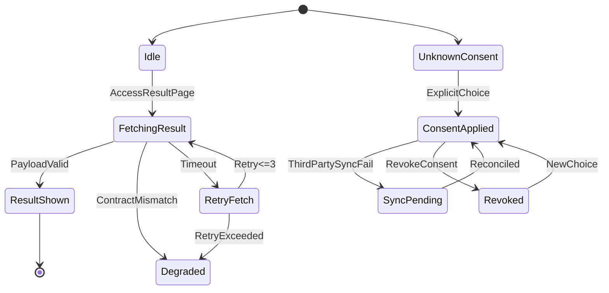
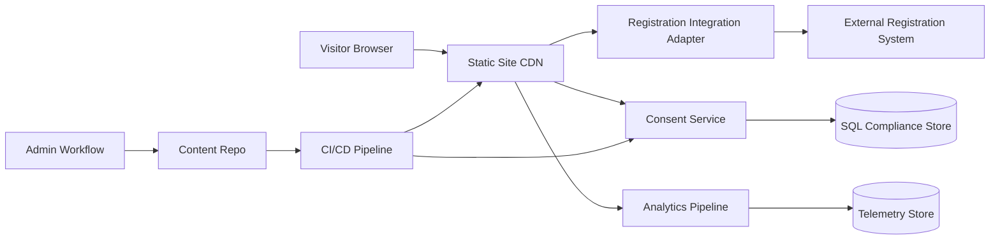

# PRD Técnico de Engenharia e Arquitetura de Produto
Base consolidada: [ idea.md ](.SPECS/idea.md), [ ldpg_design.md ](.SPECS/ldpg_design.md), [ test_design.md ](.SPECS/test_design.md).  
Produto: Conecta PrismRR.

## 1. Fundações e Visão de Produto

### 1.1 Resumo Executivo e JTBD
Problema central: comunicação de evento fragmentada, baixa confiança em informações oficiais e alta carga manual da organização.

Jobs-to-be-Done prioritários:
1. Como participante, quero encontrar regras de inscrição, cronograma e palestrantes em um único local confiável para decidir minha participação sem ruído.
2. Como organizador, quero publicar atualizações rapidamente com baixo risco de erro para reduzir retrabalho e dúvidas repetitivas.
3. Como coordenação PRISM, quero medir engajamento e conversão de inscrição para otimizar próximas edições com dados.
4. Como equipe de compliance, quero comprovar aderência LGPD em consentimento, retenção e direitos do titular.

Proposta de valor técnica:
- Hub estático de alta disponibilidade e baixo custo operacional.
- Camada dinâmica mínima para consentimento, preferências e integrações externas.
- Observabilidade e QA automatizado para manter confiabilidade editorial e técnica.

### 1.2 Hipóteses e Invariantes de Negócio
Hipóteses a validar:
- H1: Centralização aumenta taxa de conclusão de inscrição.
- H2: Atualização de cronograma em fonte única reduz inconsistências em canais paralelos.
- H3: FAQ orientado por conteúdo reduz tickets de suporte repetitivos.
- H4: Consentimento granular aumenta confiança sem reduzir significativamente conversão.

Invariantes não violáveis:
1. Nenhum dado pessoal é coletado sem finalidade definida e base legal registrada.
2. Resultado de inscrição exibido ao usuário deve refletir fonte oficial externa ou estado de indisponibilidade explícito.
3. Conteúdo crítico do evento deve ter trilha de versão e autor.
4. Consentimento de marketing, cookies não essenciais e anúncios personalizados permanece opt-in.
5. Mudança em contratos de integração não pode quebrar renderização de páginas principais.

### 1.3 Métricas de Sucesso e Captura Técnica
North Star:
- Taxa de jornada concluída do evento = participantes que visitam Home, acessam Inscrição e chegam ao resultado/ação final.

KPIs complementares:
1. Conversão Home para Inscrição.
2. Latência p95 da página de cronograma.
3. Taxa de falha de ingestão de dados externos.
4. Cobertura de testes em fluxos críticos.
5. Taxa de consentimento explícito por finalidade.
6. Defeitos escapados por release.

Captura técnica:
- Telemetria de eventos com esquema versionado.
- Eventos mínimos: page_view, cta_click, registration_guideline_view, registration_result_view, consent_granted, consent_revoked, external_data_sync_failed.
- Correlação por release_id, environment, source_channel.

---

## 2. Escopo Funcional e Comportamental

### 2.1 Arquitetura de Módulos (Bounded Contexts)
1. Event Content
2. Registration Guidance
3. Registration Result Integration
4. Schedule and Speakers
5. Privacy and Consent
6. Analytics and Observability
7. Admin and Publishing Workflow
8. Compliance and Audit

### 2.2 Matriz de Capacidades
| ID | Requisito | Ator | Complexidade | Risco |
|---|---|---|---|---|
| PRD-RQ01 | Exibir proposta do evento, trilhas temáticas e CTA | Visitante | M | Baixo |
| PRD-RQ02 | Publicar orientações de inscrição versionadas | Organizador | M | Médio |
| PRD-RQ03 | Consumir e exibir resultado de inscrição do sistema externo | Visitante | L | Alto |
| PRD-RQ04 | Exibir cronograma com ordenação temporal e filtros | Visitante | M | Médio |
| PRD-RQ05 | Exibir perfil de palestrantes com vínculos institucionais | Visitante | S | Baixo |
| PRD-RQ06 | Capturar consentimentos granulares e revogação | Titular de dados | M | Alto |
| PRD-RQ07 | Gerenciar cookies por categoria | Visitante | M | Alto |
| PRD-RQ08 | Registrar auditoria de alterações de conteúdo crítico | Organizador/Compliance | M | Médio |
| PRD-RQ09 | Disponibilizar canal de direitos do titular | Titular de dados | M | Alto |
| PRD-RQ10 | Monitorar disponibilidade e falhas de integração externa | Operação | M | Alto |
| PRD-RQ11 | Publicar política de privacidade e termo versionados | Visitante/Compliance | S | Médio |
| PRD-RQ12 | FAQ com respostas orientadas por base curada | Visitante | M | Médio |

### 2.3 Fluxos Críticos em FSM

#### FSM A: Consulta de Resultado de Inscrição
Estado Inicial: Idle  
Gatilho: usuário acessa página de resultado  
Condição: integração externa disponível e payload válido  
Ação: buscar dados, validar contrato, renderizar estado  
Estado Final: ResultShown

Estados de erro e recuperação:
1. ExternalTimeout: aplicar retry exponencial limitado em 3 tentativas.
2. ContractMismatch: fallback para estado Degraded com mensagem oficial e log de incidente.
3. NotFound: exibir estado sem resultado e instrução de suporte.
4. Unauthorized: solicitar autenticação adicional quando aplicável.

#### FSM B: Gestão de Consentimento
Estado Inicial: UnknownConsent  
Gatilho: usuário interage com banner/central  
Condição: escolha explícita por categoria  
Ação: persistir consentimento versionado e refletir em tags/serviços  
Estado Final: ConsentApplied

Estados de erro e recuperação:
1. PersistFailure: retry idempotente com fila local temporária.
2. VersionConflict: revalidar versão do texto e reapresentar consentimento.
3. SyncThirdPartyFail: marcar pendência e reconciliação assíncrona.

#### FSM C: Publicação de Conteúdo
Estado Inicial: Draft  
Gatilho: submit para revisão  
Condição: validações de esquema, links, LGPD e qualidade aprovadas  
Ação: merge, build, deploy preview, aprovação final  
Estado Final: Published

Estados de erro e recuperação:
1. ValidationFail: bloquear publicação e retornar relatório.
2. BuildFail: rollback automático para versão estável anterior.
3. ApprovalExpired: reiniciar ciclo de aprovação.

Diagrama de estados consolidado:

---

## 3. Arquitetura de Dados e Integridade

### 3.1 Modelo Conceitual
Entidades principais:
1. EventEdition
2. Session
3. Speaker
4. RegistrationGuidelineVersion
5. ExternalRegistrationStatus
6. ConsentRecord
7. PrivacyPreference
8. AuditEvent
9. DSARRequest

Cardinalidades:
- EventEdition 1:N Session
- Session N:N Speaker
- User 1:N ConsentRecord
- User 1:N PrivacyPreference
- User 1:N DSARRequest
- ContentItem 1:N AuditEvent

Imutabilidade:
- ConsentRecord é append-only.
- AuditEvent é append-only.
- RegistrationGuidelineVersion é imutável após publicação.

### 3.2 Estratégia de Persistência (SQL/NoSQL)
Decisão por módulo:
1. Conteúdo público do site: Git + arquivos estáticos gerados.
2. Consentimento, auditoria e DSAR: SQL relacional.
3. Cache de integração externa e sessões efêmeras: chave-valor.
4. Logs observabilidade: armazenamento orientado a séries temporais/log analytics.

Justificativa:
- SQL para consistência forte e auditoria regulatória.
- Cache para resiliência e latência baixa.
- Conteúdo estático para custo e disponibilidade.

### 3.3 Evolução de Schema sem Downtime
Padrão expand-contract:
1. Expandir schema com novos campos opcionais.
2. Atualizar aplicação para escrita dual quando necessário.
3. Backfill assíncrono.
4. Migrar leitura para novo campo.
5. Remover campo legado em release posterior.

Regras:
- Migração reversível.
- Feature flags para alternância gradual.
- Janela de observação entre etapas.

### 3.4 Sincronização e Concorrência
Requisitos:
1. Idempotência em ingestão de resultados externos por chave natural.
2. Controle otimista para atualização de preferências.
3. Deduplicação por event_id e hash de payload.
4. Retry com jitter para falhas transitórias.
5. Compensação para falhas de sincronização com terceiros.

---

## 4. Requisitos Não Funcionais e Segurança

### 4.1 Performance e Latência (SLO)
SLOs propostos:
1. Disponibilidade mensal do site: 99,9%.
2. p95 Home: até 1,2s em rede 4G.
3. p95 Cronograma: até 1,5s.
4. p95 consulta de resultado com integração ativa: até 2,0s.
5. Taxa de erro 5xx em páginas críticas: abaixo de 0,5%.

### 4.2 Segurança por Design
Modelo de ameaças simplificado:
1. XSS via conteúdo externo ou campos dinâmicos.
2. Exposição indevida em integrações de terceiros.
3. Comprometimento de cadeia de dependências.
4. Sequestro de sessão administrativa.
5. Defacement por pipeline inseguro.

Controles mandatórios:
1. Sanitização estrita e política CSP.
2. RBAC para administração e ABAC para operações sensíveis.
3. Criptografia em trânsito e em repouso.
4. Segredos em cofre, nunca em repositório.
5. Trilha de auditoria imutável.
6. SAST, SCA, DAST e varredura de segredos no CI.

### 4.3 Acessibilidade e UX Técnica
Baseline:
1. WCAG 2.1 AA em fluxos críticos.
2. Navegação por teclado em 100% dos componentes interativos.
3. Contraste mínimo conforme diretrizes AA.
4. LCP até 2,5s e INP em faixa boa.
5. Testes automatizados de acessibilidade em PR.

---

## 5. Estratégia de Desenvolvimento e DX

### 5.1 Ambiente de Desenvolvimento
Padrão de reprodutibilidade:
1. DevContainer com runtime padronizado.
2. Docker Compose para serviços locais de teste.
3. Dados sintéticos para integração.
4. Seed determinístico para cenários de QA.
5. Scripts únicos para setup e execução de suítes.

### 5.2 Contratos de Interface
Padrão recomendado:
1. REST para integrações externas de inscrição.
2. Contratos OpenAPI versionados.
3. Testes de contrato consumidor-provedor.
4. Política de versionamento semântico para breaking changes.

### 5.3 Estratégia de Testabilidade
Distribuição de esforço:
1. Unitários: 55%.
2. Integração: 25%.
3. Componente: 15%.
4. E2E: 5%.

Foco:
- Unitário para transformação de dados e regras.
- Integração para pipelines de ingestão e consentimento.
- Contrato para estabilidade com sistema externo.
- E2E enxuto para jornadas críticas.

Arquitetura de componentes:

---

## 6. Roadmap de Entrega e Mitigação

### 6.1 Definição de MVP
Núcleo duro do MVP:
1. Página principal institucional.
2. Orientações de inscrição com conteúdo versionado.
3. Cronograma e palestrantes.
4. Exibição de resultado de inscrição com fallback resiliente.
5. Consentimento granular e política de privacidade ativa.
6. Telemetria mínima para conversão e saúde.

### 6.2 Milestones Técnicos

#### Fase 1: Proof of Concept
Objetivo: validar riscos técnicos de integração, compliance e qualidade.
Entregas:
1. Contrato de integração e mock estável.
2. Pipeline básico com testes unitários, contrato e a11y smoke.
3. Banner de consentimento com persistência versionada.
4. Monitoramento inicial de disponibilidade.

#### Fase 2: Alpha/Beta
Objetivo: fechar fluxos críticos e iniciar operação controlada.
Entregas:
1. Páginas completas Home, Inscrição, Cronograma e Palestrantes.
2. FSM de consulta de resultado com retry e modo degradado.
3. Central de preferências e trilha de auditoria.
4. VRT e hardening de segurança no CI/CD.

#### Fase 3: General Availability
Objetivo: escala, resiliência e otimização de custo.
Entregas:
1. Otimização de performance e cache.
2. Observabilidade avançada com alertas por SLO.
3. Playbooks de incidente e exercícios de recuperação.
4. Revisão de custos de infraestrutura e tags de governança.

### 6.3 Matriz de Riscos
| Risco | Probabilidade | Impacto | Mitigação | Contingência |
|---|---:|---:|---|---|
| Quebra de contrato com sistema externo | Alta | Alta | Teste de contrato + schema validation | Modo degradado com mensagem oficial |
| Falha de consentimento/cookies | Média | Alta | Central de preferências + testes automatizados | Bloqueio de tags não essenciais |
| Flakiness em testes E2E | Alta | Média | POM/App Actions + datasets determinísticos | Quarentena automática com SLA de correção |
| Vulnerabilidade em dependência | Média | Alta | SCA com bloqueio para criticidade alta | Pinning e rollback de release |
| Inconsistência editorial | Média | Média | Workflow com revisão e auditoria | Reverter para versão anterior publicada |

---

## 7. Trade-off Analysis (decisões arquiteturais)

| Decisão | Opção A | Opção B | Escolha e motivo |
|---|---|---|---|
| Renderização principal | Site estático com geração | SPA dinâmica completa | A: menor custo, maior disponibilidade, melhor SEO e menor superfície de ataque |
| Persistência de compliance | SQL relacional | NoSQL documento | A: integridade transacional e auditabilidade para LGPD |
| Integração externa | Pull síncrono por demanda | Espelhamento completo local | A com cache: reduz complexidade e mantém fonte oficial; fallback cobre indisponibilidade |
| Contratos de API | OpenAPI + testes de contrato | Testes manuais ad hoc | A: detecta breaking change cedo e reduz regressão |
| Observabilidade | Telemetria estruturada end-to-end | Logs dispersos sem correlação | A: acelera MTTR e facilita prestação de contas |
| Estratégia de testes | Pirâmide com ênfase unitária | Predomínio E2E | A: menor flake, menor custo e feedback mais rápido |

---

## 8. Rastreabilidade Requisito ↔ Roadmap ↔ Métrica

| Roadmap Item | Requisitos vinculados | Métrica de sucesso |
|---|---|---|
| PoC de contrato externo | PRD-RQ03, PRD-RQ10 | Taxa de falha de ingestão menor que 1% |
| Consentimento versionado | PRD-RQ06, PRD-RQ07, PRD-RQ11 | 100% dos consentimentos auditáveis |
| Páginas críticas em produção | PRD-RQ01, PRD-RQ02, PRD-RQ04, PRD-RQ05 | Conversão Home para Inscrição |
| FSM com fallback | PRD-RQ03, PRD-RQ10 | Disponibilidade percebida em jornada de resultado |
| Trilha de auditoria e DSAR | PRD-RQ08, PRD-RQ09 | SLA de atendimento de solicitações |
| Pipeline QA/AppSec completo | PRD-RQ10, PRD-RQ12 | Defeitos escapados por release e MTTR |

---

## 9. Critérios de Pronto (Definition of Done) por épico
1. Requisito funcional validado por teste automatizado e critério de aceite.
2. Telemetria de eventos e logs de erro instrumentados.
3. Requisitos LGPD e segurança aplicáveis evidenciados.
4. Documentação de operação e rollback disponível.
5. Métrica de sucesso conectada ao dashboard de produto.

---