# Technical Audit and QA/AppSec Strategy
Scope based on idea.md: static Jekyll event site, external registration-results source, schedule/speakers pages, low-latency public delivery, and recurring event updates.

## Architecture Assumptions
1. Site is generated with Jekyll and deployed to CDN/static hosting.
2. Registration results are consumed from an external system (API/file export/embed).
3. Optional intelligent layer is API-based (FAQ summaries/assistant), not a full backend rewrite.
4. CI/CD is GitHub Actions with preview deploys per Pull Request.

## 1. Test Architecture and Validation Strategy
## Custom Test Pyramid (fit for static + data-driven site)
- Unit: 55%
- Integration: 25%
- Component: 15%
- E2E: 5%

Rationale:
- Unit dominates because most defects will be in templates, data transforms, validation logic, and content rules.
- Integration validates build pipelines, data ingestion, and schema compatibility.
- Component checks UI blocks (hero, timeline, speaker cards, registration status cards).
- E2E remains lean to reduce flaky tests and runtime.

## Contracts and APIs (Consumer-Driven)
- Define a consumer contract for registration payload consumed by build/runtime.
- Use Pact for provider-consumer compatibility if registration system exposes API.
- Use Prism mock server in CI for deterministic contract tests when provider is unavailable.
- Gate rule: merge blocked if contract verification fails against current provider version.

Contract policy:
- Backward-compatible additions allowed.
- Breaking field changes require versioned contract and migration window.
- “Contract drift” alert on any undocumented payload variation.

## Ephemeral Environments (PR parity with production)
- Per PR:
  - Build container image for site generation.
  - Start isolated Docker Compose stack.
  - Deploy preview with same CDN/security headers as production profile.
  - Run integration, E2E, accessibility, DAST against preview URL.
- Destroy environment on PR close/merge to control cost and noise.

---

## 2. Quality Engineering (TDD & BDD)
## Red-Green-Refactor for async/business flows
- Red: write failing tests for content eligibility rules, schedule ordering, registration-state rendering.
- Green: implement minimal logic to satisfy acceptance.
- Refactor: normalize data access, isolate template helpers, remove duplicated conditions.

Async-focused TDD patterns:
- Deterministic clocks for deadlines/countdowns.
- Mocked network boundaries for external registration source.
- Explicit retry/backoff tests for transient fetch failures.

## Automation Standards (E2E maintainability)
- Mandatory App Actions for repetitive setup (login-equivalent flows, page seed state, locale switch).
- Mandatory POM for page abstractions and locator centralization.
- Selector policy:
  - Prefer data-testid attributes.
  - Forbid CSS-path selectors in new tests.
- Flaky budget:
  - If a spec flakes 2 times in 7 days, quarantined automatically and tracked as defect.

## Test Data Management (TDM)
- Synthetic datasets generated via schema-aware factories (valid, boundary, malformed).
- Deterministic seed by test suite to reproduce failures.
- Data reset:
  - Stateless mode preferred for static generation tests.
  - If temporary DB/cache exists in preview services, truncate between test jobs.

---

## 3. UX, UI, and Accessibility (Shift-Left)
## Visual Regression Testing
- Use Playwright VRT for baseline snapshots on key routes.
- Use Applitools for cross-browser visual AI diff in nightly pipeline.
- Tolerance policy:
  - Pixel threshold near zero for layout blocks.
  - Explicit ignore regions only for timestamps/dynamic badges.

## Automated Accessibility
- Integrate axe-core in Playwright tests.
- Quality gate:
  - Block merge on critical/serious WCAG failures.
  - Warn-only for moderate/minor issues initially (tighten in Month 1).
- Minimum required checks:
  - Contrast, heading order, landmarks, keyboard focus, ARIA role/name/value.

---

## 4. Security Strategy (SSDLC & OWASP)
## Threat Modeling (priority attack vectors)
1. Supply chain compromise in build dependencies/plugins.
2. XSS via untrusted external registration/speaker data rendered in templates.
3. Misconfigured secrets in CI and preview environments.
4. Content spoofing/defacement through weak deployment controls.
5. Third-party script/icon asset trust and integrity issues.

## Static and Dynamic Analysis
### SAST
- Semgrep custom rules for:
  - Unsafe Liquid/HTML rendering.
  - Dangerous JS DOM sinks (innerHTML, eval-like patterns).
  - Missing output encoding in template helpers.
- Secret scanning in every commit (gitleaks + push protection).

### DAST
- OWASP ZAP baseline against PR preview URL.
- Auth-less public-surface crawl with passive checks always on.
- Active scan on nightly or release candidate to control CI duration.

### SCA
- Dependabot + OSV scan on lockfiles.
- Policy:
  - Critical vulnerabilities block merge.
  - High vulnerabilities require exception ticket with expiry.

## Infrastructure Security
- CI identity via OIDC (no long-lived cloud keys).
- Least-privilege IAM per environment.
- Container hardening:
  - Distroless/minimal images.
  - Non-root user.
  - Read-only filesystem where possible.
- CSP, HSTS, X-Content-Type-Options, Referrer-Policy enforced in hosting layer.

---

## 5. DevSecOps Pipeline and Observability
## Pipeline Visualization (Mermaid)

```mermaid
flowchart LR
A[Pre-commit Hook<br/>lint + unit + secrets scan] --> B[PR Open]
B --> C[CI Build<br/>Jekyll build + schema validation]
C --> D[Unit/Integration/Component Tests]
D --> E[Contract Tests<br/>Pact + Prism]
E --> F[Accessibility + VRT]
F --> G[SAST + SCA]
G --> H[Ephemeral Preview Deploy]
H --> I[DAST Baseline + E2E Smoke]
I --> J[Quality Gate Decision]
J -->|Pass| K[Merge to Main]
J -->|Fail| L[Block + Feedback]
K --> M[Staging Deploy]
M --> N[Canary Deployment]
N --> O[Telemetry Watch<br/>logs/metrics/traces]
O --> P[Progressive Rollout or Rollback]
```


## Engineering Performance Metrics (DORA)
- Deployment Frequency:
  - Target: daily for content updates; 2-3/week for feature changes.
- Lead Time for Changes:
  - Target: < 24h for low-risk updates; < 72h for feature PRs.
- MTTR:
  - Target: < 60 minutes for production incident containment.
- Change Failure Rate:
  - Target: < 10% with trend down quarter-over-quarter.

## Observability (OpenTelemetry + web telemetry)
- Instrument build/deploy/test pipeline events as traces.
- Capture frontend web vitals and route-level errors.
- Correlate release version with:
  - a11y violations,
  - test flake rate,
  - traffic-drop anomalies.
- “Escaped defect” triage:
  - Every production bug gets a missing-test tag and prevention action.

---

## 6. Diagnosis and Action Plan
## Risk Matrix (Top 3 Fragile Points)

| Fragile Point | Type | Probability | Impact | Risk | Mitigation |
|---|---|---:|---:|---:|---|
| Unvalidated external registration payload breaks pages | Technical/Security | High | High | Critical | Contract tests, schema validation, safe rendering, fallback UI |
| Flaky E2E and visual tests slowing delivery | Quality | High | Medium | High | POM/App Actions, deterministic data, quarantine policy, test retries capped |
| Dependency/plugin vulnerability in static pipeline | Security | Medium | High | High | SCA blocking policy, pinned versions, signed artifacts, patch SLA |

## Implementation Roadmap
### Week 1 (Critical)
1. Establish quality gates: lint, unit, secrets scan, SCA, baseline SAST.
2. Implement contract schema + Prism mocks for registration data.
3. Add Playwright smoke + axe-core checks on core pages.
4. Enable PR ephemeral preview and basic ZAP baseline scan.

### Month 1 (Structural)
1. Introduce full test pyramid and flake governance dashboard.
2. Add visual regression baseline and approval workflow.
3. Harden CI security: OIDC, IAM least privilege, artifact provenance.
4. Add CSP/HSTS/security headers and automated verification tests.

### Quarter 1 (Optimization)
1. Expand contract testing to versioned contracts and provider verification automation.
2. Add canary + automated rollback based on error/performance SLOs.
3. Implement escaped-defect analytics linked to missing test categories.
4. Tune DORA targets and remove top 20% test-suite bottlenecks.

---

## Configuration Examples
## Example: .github/workflows/ci.yml
```yaml
name: ci
on:
  pull_request:
  push:
    branches: [main]

jobs:
  quality-security:
    runs-on: ubuntu-latest
    permissions:
      contents: read
      id-token: write
      security-events: write
    steps:
      - uses: actions/checkout@v4

      - uses: ruby/setup-ruby@v1
        with:
          ruby-version: "3.3"
          bundler-cache: true

      - name: Build site
        run: bundle exec jekyll build

      - name: Unit/Integration tests
        run: npm ci && npm test -- --ci

      - name: Contract tests
        run: npm run test:contract

      - name: Accessibility + E2E smoke
        run: npm run test:e2e:smoke

      - name: Semgrep SAST
        uses: returntocorp/semgrep-action@v1
        with:
          config: p/security-audit

      - name: OSV dependency scan
        uses: google/osv-scanner-action@v1
        with:
          scan-args: -r .

      - name: Secrets scan
        uses: gitleaks/gitleaks-action@v2
```

## Example: docker-compose.test.yml
```yaml
version: "3.9"
services:
  site:
    image: ruby:3.3
    working_dir: /app
    volumes:
      - ./:/app
    command: sh -lc "bundle install && bundle exec jekyll serve --host 0.0.0.0 --port 4000"

  prism-mock:
    image: stoplight/prism:5
    command: mock -h 0.0.0.0 /contracts/registration-openapi.yaml
    volumes:
      - ./contracts:/contracts
    ports:
      - "4010:4010"

  tests:
    image: mcr.microsoft.com/playwright:v1.54.0-jammy
    working_dir: /work
    volumes:
      - ./:/work
    depends_on:
      - site
      - prism-mock
    command: sh -lc "npm ci && npm run test:e2e && npm run test:a11y"
```

## Example: jest.config.js
```js
module.exports = {
  testEnvironment: "node",
  collectCoverage: true,
  coverageThreshold: {
    global: { branches: 85, functions: 90, lines: 90, statements: 90 }
  },
  testPathIgnorePatterns: ["/node_modules/", "/dist/"],
  maxWorkers: "50%"
};
```

---

## Economic Justification (ROI)
- Preventing one production regression in registration visibility avoids reputational damage and support overhead during high-traffic periods.
- Automated contract + accessibility + security gates reduce manual QA effort and rework cost, shifting detection to low-cost stages.
- Flake reduction increases developer throughput and lowers CI waste, improving lead time and deployment confidence.
- For this system profile, priority automation (contracts, SAST/SCA, a11y smoke, PR previews) typically pays back within 1-2 release cycles through avoided rollback, faster approvals, and lower incident response effort.