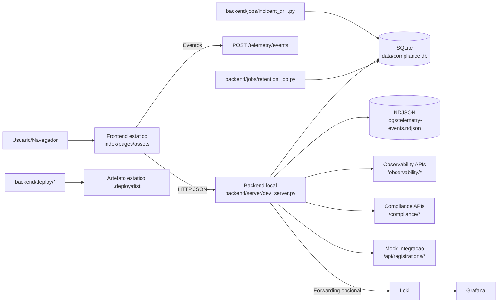

# Arquitetura do Projeto

Este documento apresenta o mapa unico da arquitetura do Conecta PrismRR, com separacao entre frontend, backend e infraestrutura.

## Mapa de camadas

## Estrutura canonica

Frontend:
- [frontend/README.md](../frontend/README.md)
- [index.html](../index.html)
- [pages](../pages)
- [assets](../assets)

Backend:
- [backend/server/dev_server.py](../backend/server/dev_server.py)
- [backend/jobs/retention_job.py](../backend/jobs/retention_job.py)
- [backend/jobs/incident_drill.py](../backend/jobs/incident_drill.py)
- [backend/deploy/build_static.sh](../backend/deploy/build_static.sh)
- [backend/deploy/deploy_static.sh](../backend/deploy/deploy_static.sh)

Infra:
- [infra/observability/docker-compose.yml](../infra/observability/docker-compose.yml)
- [infra/observability/loki/loki-config.yaml](../infra/observability/loki/loki-config.yaml)
- [infra/observability/grafana/provisioning/datasources/loki.yaml](../infra/observability/grafana/provisioning/datasources/loki.yaml)

Compatibilidade legada:
- [scripts](../scripts) (wrappers de compatibilidade)
- Plano de transicao concluido: [docs/deprecacao-ops.md](./deprecacao-ops.md)

## Fronteiras de responsabilidade

Frontend:
- Renderizacao e UX.
- Emissao de telemetria.
- Consumo de APIs locais/remotas.
- Configuracao do banner superior centralizada em `assets/js/config.js`.

Backend:
- Exposicao de APIs de telemetria, compliance, observability e mock de integracao.
- Persistencia SQLite e agregacoes.
- Jobs operacionais e evidencias de compliance.
- Build/deploy estatico.

Infra:
- Stack local Loki/Grafana para persistencia e exploracao de observabilidade.
- Configuracoes de runtime dos componentes de observability.

## Fluxos principais

Fluxo de telemetria:
1. Frontend envia evento para /telemetry/events.
2. Backend grava em NDJSON e SQLite.
3. Backend faz forwarding opcional para Loki.
4. Grafana consulta dados via Loki.

Fluxo de compliance:
1. Frontend ou job escreve eventos em /compliance/* ou direto nas rotinas.
2. Backend persiste trilha append-only em SQLite.
3. Jobs de retencao e incident drill geram evidencias.

Fluxo de deploy:
1. Build estatico por [backend/deploy/build_static.sh](../backend/deploy/build_static.sh).
2. Publicacao por [backend/deploy/deploy_static.sh](../backend/deploy/deploy_static.sh).
3. CI executa workflow de deploy em ambientes develop/production.

## Configuracao centralizada de UI

Banner superior dinamico:
1. O conteudo fica em [assets/js/config.js](../assets/js/config.js), no bloco `topBanner`.
2. O frontend renderiza o banner em [assets/js/site.js](../assets/js/site.js), inserindo a secao logo apos o cabecalho.
3. As paginas HTML nao repetem mais markup de banner, reduzindo divergencia entre rotas.

Campos esperados em `topBanner`:
- `enabled`: liga/desliga exibicao.
- `label`: prefixo em destaque (ex.: Comunicado:).
- `message`: texto principal exibido para o usuario.

## Comandos canonicos

- Servidor local: `python3 backend/server/dev_server.py --port 8080`
- Stack observability: `docker compose -f infra/observability/docker-compose.yml up -d`
- Stack completa local: `npm run dev:docker:full`
- Build deploy: `npm run deploy:build`
